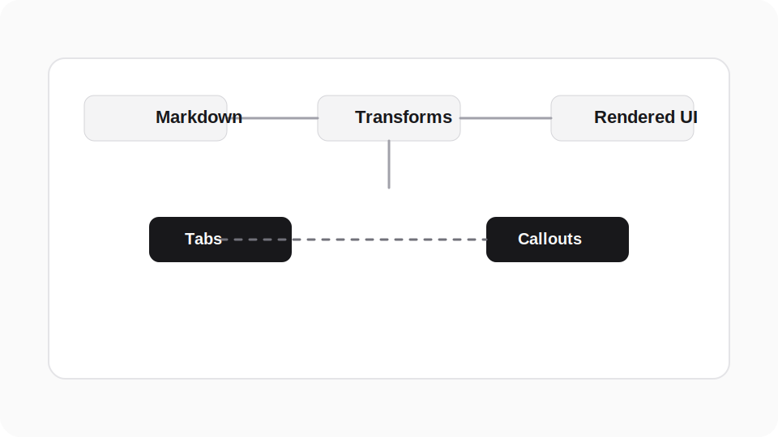

# Formatting Reference

This page is a live reference for the markdown and UI behaviors currently supported by Clio KB.

Use it for two things:

- see how supported patterns render in the site
- copy the source syntax into your own docs

## Typography

Regular body copy keeps a comfortable reading width and spacing.

You can use **strong text**, *emphasis*, ***combined emphasis***, inline `code`, and even raw HTML such as <mark>highlighted text</mark> when you need it.

Longer paragraphs should still read cleanly across multiple lines. The page shell handles line length, paragraph rhythm, and heading anchors automatically.

### Lists

- Unordered list item
- Another unordered item
- A third item with `inline code`

1. Ordered lists also work
2. They keep the standard markdown flow
3. Nested content is supported if you need it

### Blockquote

> This is a standard blockquote.
> It stays a plain quote unless it matches one of the callout patterns below.

## Headings And Anchors

Every heading gets an anchor link in the rendered page.

### Deep Link Example

Hover the heading and use the link icon to copy a direct URL to that section.

## Callouts

Callouts are just blockquotes whose first line starts with a bold label.

Rendered examples:

> **Note:** Use notes for neutral context or explanations.

> **Info:** Use info when something is useful to know before continuing.

> **Tip:** Use tips for shortcuts, good defaults, or recommended workflows.

> **Warning:** Use warnings when readers could break the site or lose work.

> **Danger:** Use danger for destructive or high-risk actions.

Source pattern:

```md
> **Note:** Use notes for neutral context or explanations.

> **Info:** Use info when something is useful to know before continuing.

> **Tip:** Use tips for shortcuts, good defaults, or recommended workflows.

> **Warning:** Use warnings when readers could break the site or lose work.

> **Danger:** Use danger for destructive or high-risk actions.
```

## Tabs

Tabs use HTML comments so the source markdown stays portable.

Rendered example:

<!-- tabs: CLI, JSON, Notes -->
<!-- tab: CLI -->
```sh
npm run docs:build:auto
python3 -m http.server 4321 --directory .site
```
<!-- tab: JSON -->
```json
{
  "title": "Formatting Reference",
  "file": "../docs/reference/formatting-reference.md"
}
```
<!-- tab: Notes -->
Use tabs when the same instruction needs multiple representations, such as command-line, JSON, or UI variants.
<!-- /tabs -->

Source pattern:

````md
&lt;!-- tabs: CLI, JSON, Notes --&gt;
&lt;!-- tab: CLI --&gt;
```sh
npm run docs:build:auto
python3 -m http.server 4321 --directory .site
```
&lt;!-- tab: JSON --&gt;
```json
{
  "title": "Formatting Reference",
  "file": "../docs/reference/formatting-reference.md"
}
```
&lt;!-- tab: Notes --&gt;
Use tabs when the same instruction needs multiple representations.
&lt;!-- /tabs --&gt;
````

### Code Tabs

If every tab panel contains a single code block, Clio KB automatically uses the code-tab presentation.

<!-- tabs: JavaScript, TypeScript -->
<!-- tab: JavaScript -->
```js
console.log("Clio KB");
```
<!-- tab: TypeScript -->
```ts
const label: string = "Clio KB";
console.log(label);
```
<!-- /tabs -->

## Links

Internal markdown links are intercepted and routed inside the SPA:

- [Project Structure](./project-structure.md)
- [Navigation](../customization/navigation.md)

External links open normally:

- [Lucide Icons](https://lucide.dev/icons)
- [Marked](https://marked.js.org/)

## Tables

Tables are wrapped automatically so wide content scrolls instead of breaking the layout.

| Feature | Syntax | Notes |
| --- | --- | --- |
| Callouts | Blockquote + `**Note:**` | Labels supported: Note, Info, Tip, Warning, Danger |
| Tabs | HTML comments | Supports regular tabs and code tabs |
| Internal links | Relative `.md` links | Routed in-app |
| Heading anchors | Automatic | Added to headings after render |

## Code Blocks

Fenced code blocks get a copy button automatically.

```sh
node site/build-release.mjs --base-path auto --out-dir .site
```

```js
function greet(name) {
  return `Hello, ${name}`;
}
```

## Horizontal Rule

---

The horizontal rule above uses plain markdown.

## Images

Standard markdown images are supported.



If an image cannot be loaded, the app replaces it with a styled placeholder rather than leaving a broken image element.

## Raw HTML

Because Clio KB uses `marked`, simple inline HTML is allowed when markdown alone is not enough.

Examples:

- <kbd>Cmd</kbd> + <kbd>K</kbd>
- <mark>Highlighted copy</mark>
- <sup>Superscript</sup>

## Practical Authoring Notes

- Keep navigation in `site/content.json`
- Keep docs content in `docs/`
- Use relative `.md` links between pages
- Rebuild after structural changes so the generated `.site/` bundle stays in sync
